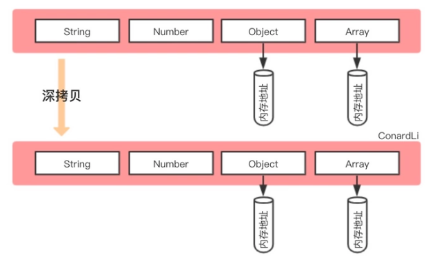

# 对象

## 属性管理

### 检测属性

* 使用 `obj.hasOwnProperty("属性名")` 来检测这个对象本身是否有这个属性
* 使用 `"属性名" in obj` 来检测这个对象以及这个对象的原型链上是否有这个属性

```js
const men = {
  gender: 'man'
}

const obj = {
  name: 'gdz',
  age: 18,
};

console.log(obj.hasOwnProperty('name'))
console.log(obj.hasOwnProperty('name1'));

// 设置 obj 的原型对象（也就是设置它的父类）
Object.setPrototypeOf(obj, men);

console.log(obj.gender) // man 
console.log(obj.hasOwnProperty('gender'));

// 判断 对象 以及 对象的原型 上是否有这个属性
console.log('gender' in obj);


```


## 赋值

如果值的类型是基本类型，那么就是直接值。
如果值是引用类型，当我们把一个对象赋值给你一个新的对象时，赋的其实是该对象在栈中的地址，而不是堆中的数据。也就是两个对象指向的是同一个存储空间，无论哪个对象发生改变，其实都是改变的内存空间的内容，因此两个对象是联动的。


## 拷贝
拷贝是指由一个对象(data)生成另一个一模一样的对象(o1)。但是 o1 的修改不能影响 data 的值

```javascript
const data = {
  tile: '第一个对象',
  dataIndex: 'first',
  componentProps: {
    path: 'user/',
    mode: 'add',
  }
}

const o1 = Object.assign({}, data)
const o2 = { ...data }
```


### 浅拷贝

浅拷贝是创建一个新对象，这个对象有着原始对象属性值的一份精确拷贝。**如果属性值是基本类型，拷贝的就是基本类型的值，如果属性是引用类型，拷贝的就是内存地址**，所以如果其中一个对象改变了这个地址中的内容，就会影响到另一个对象。

浅拷贝是：把 data 复制了过来，但是 data 的修改有可能会影响到 复制过来的对象 o1。
尤其是当 data 有个属性值为 对象的属性时。也就是说 我们不能深层次的复制。


实现浅拷贝的方式有
1. `Object.assign({}, data)`

   ```js
   const o1 = Object.assign({}, data)
   ```

2. 展开运算符 `{ ...data }`
    ```js
    const o2 = { ...data }
    ```

3. 也可以自己遍历复制属性
    ```javascript
    function copy(o) {
      let res = {};
      for (const key in o) {
        res[key] = o[key];
      }
      return res;
    }
    ```

4. concat 针对 Array
    ```javascript
    // Array.prototype.concat()
    const aa = [ 1, 2, { a: 3 } ].concat()
    
    ```

5. slice 针对 Array
    ```javascript
    // Array.prototype.slice()  
    const aa = [ 1, 2, { a: 3 } ].slice()
    ```


### 深拷贝
深拷贝是将一个对象从内存地址中玩完整的拷贝一份出来，从堆内从中开辟一个新的内存区域存放新对象，且修改新对象不会影响原对象。

深拷贝是：data 的修改不会影响到 o1，这是两个完全独立的对象。



实现深拷贝的几种方式

1. 自己实现一个 `deepCopy`
    ```javascript
    function deepCopy(obj) {
      let res = obj instanceof Array ? [] : {};
      for (const [k, v] of Object.entries(obj)) {
        res[k] = typeof v === "object" ? deepCopy(v) : v;
      }
      return res;
    }
    ```


2. 利用 `JSON` api
    ```javascript
    JSON.parse(JSON.stringify(arrayData))
    ```
	缺点：作用于对象或者数组，不接受函数 


## 创建对象

对象可以通过内置或者自定义的构造函数创建


### 字面量

直接通过 `{}` 的方式生成

```js
const obj = {
  name: 'gdz'
}
```


### 工厂函数

在函数中返回对象的函数称为对象工厂函数。

好处是：

1. 可以创建多个结构相同的对象

```js
// 工厂函数的方式
function stu(name) {
  return {
    name,
    show() {
      console.log(this.name)
    }
  }
};

const s1 = stu('工厂1');
s1.show();
const s2 = stu('工厂2')
s2.show();
```


### 构造函数

* 构造函数**首字母大写**
* 使用 new 关键字生成对象
* this 指向当前创建的对象

```js
// 构造函数
function Student(name) {
  this.name = name;
  this.show = function () {
    console.log(this.name)
  }
};

const s1 = new Student('构造函数1');
s1.show();
const s2 = new Student('构造函数2')
s2.show();
```


## 抽象特性

使用「闭包」+「构造函数」可以很好的实现抽象

```js
function User(name, age) {
  this.name = name;
  this.age = age;
  this.show = function () {
    console.log(this.name + this.info())
  }

  this.info = function () {
    return this.age > 50 ? '中老年' : '青年'
  }
}

const u1 = new User('耿德洲');

u1.show(); // 耿德洲青年
u1.info = () => '你好'
u1.show(); // 耿德洲你好
```

上面的例子中的属性和方法都可以被外部访问和修改，这样就会破坏程序内部的逻辑。如果我们只想暴露一些方法应该怎么办呢

```js
function Person(name, age) {
  const data = { name, age };

  function info() {
    return data.age > 50 ? '中老年' : '青年'
  }

  this.show = function () {
    console.log(data.name + info())
  }

}

const p1 = new Person('耿德洲');
p1.show(); // 耿德洲青年
p1.info = '你好'
p1.show(); // 耿德洲青年
```


## 属性特征

### 查看特征

使用 `Object.getOwnPropertyDescriptor(对象，属性名称)` 查看对象属性的特征

```javascript
const obj = {
  name: 'gdz'
}

const desc = Object.getOwnPropertyDescriptor(obj, 'name')

{
  "value": "gdz",
  "writable": true,
  "enumerable": true,
  "configurable": true
}
```


### 设置特征

* 使用 `Object.defineProperty(对象, '属性名', 配置对象)`

  ```js
  const user = {
    name: "gdz"
  };
  Object.defineProperty(user, "name", {
    value: "value",
    writable: false,
    enumerable: false,
    configurable: false
  });
  ```

  

* 使用 `Object.defineProperties(对象，配置对象 Map)`

  ```js
  Object.defineProperties(this, {
    name: {
      get() {
        return data.name;
      },
      set(value) {
        if (value.length < 2) {
          throw new Error('用户名无效')
        };
        data.name = value
      },
      age: {
        get() {
          return data.name;
        },
        set(value) {
          if (value.length < 2) {
            throw new Error('用户名无效')
          };
          data.name = value
        },
      }
    }
  })
  ```

  

### 冻结属性

`Object.freeze(对象)` 冻结对象后不允许添加、删除、修改属性，writable、configurable 都标记为`false`


## 属性访问器

### getter & setter

getter 方法用于获取属性值，setter 方法用来设置属性值。

1. 可以避免错误的赋值

```javascript
const user = {
  data: { name: 'gengdezhou', age: 18 },
  set age(value) {
    if (typeof value !== 'number') {
      throw Error('必须是数字类型');
    }
    this.data.age = value;
  },
  get age() {
    return `年龄是${this.data.age}`
  }
}

console.log(user.age);
user.age = 'sfs';
console.log(user.age)
```


### 访问器描述符

* 使用 `Object.defineProperty(对象, '属性名', 配置对象)`
* 使用 `Object.defineProperties(对象，配置对象 Map)`

使用上面方法可以模拟私有属性

```js
function User1(name, age) {
  const data = { name, age };
  Object.defineProperties(this, {
    name: {
      get() {
        return data.name;
      },
      set(value) {
        if (value.length < 2) {
          throw new Error('用户名无效')
        };
        data.name = value
      },
      age: {
        get() {
          return data.name;
        },
        set(value) {
          if (value.length < 2) {
            throw new Error('用户名无效')
          };
          data.name = value
        },
      }
    }
  })
}

const u1s = new User1('gdz', 18);
u1s.name = 's'; // 这里会报错
console.log(u1s.name);
```

上面代码用 Class 实现

```js
const DATA = Symbol();
class UserClass {
  constructor(name, age) {
    this[DATA] = { name, age };
  }
  get name() {
    return this[DATA].name;
  }
  set name(value) {
    if (value.trim() == "") throw new Error("无效的用户名");
    this[DATA].name = value;
  }
  get age() {
    return this[DATA].name;
  }
  set age(value) {
    if (value.trim() == "") throw new Error("无效的用户名");
    this[DATA].name = value;
  }
}

const u1s = new UserClass('gdz', 18);
u1s.name = 'class';
console.log(u1s.name);
```

