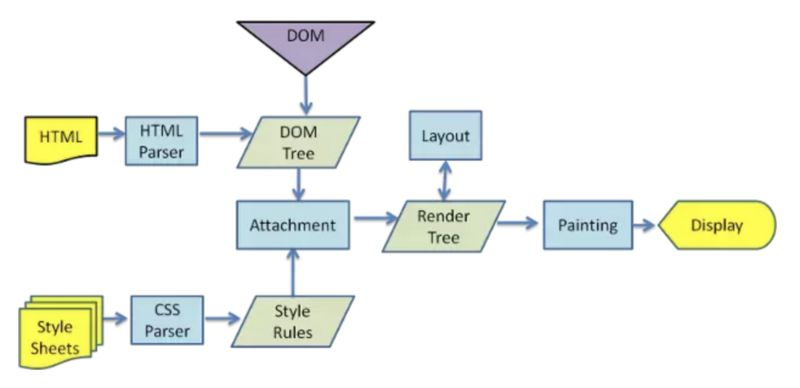
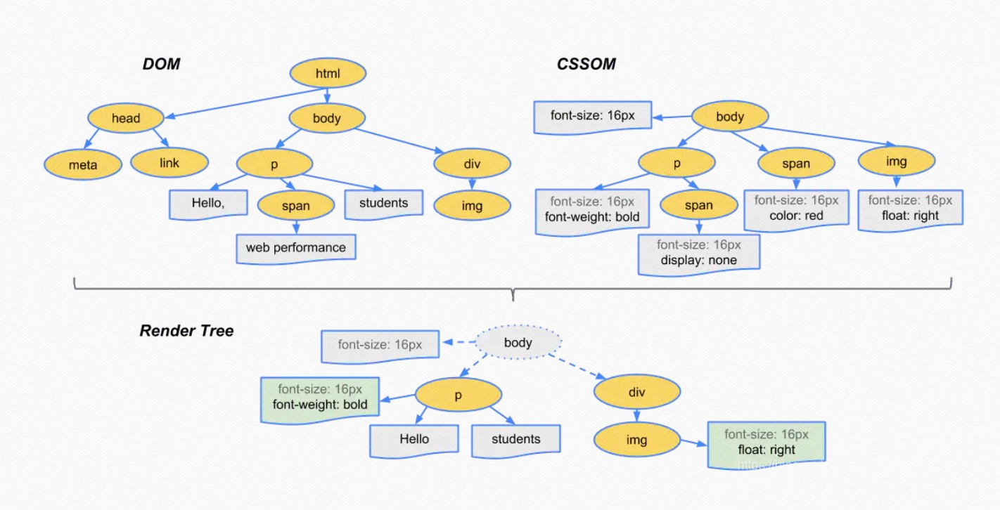

# 浏览器基础

[toc]

## 浏览器的渲染机制

1. 解析 HTML 文件，**构建 DOM 树**，同时下载 CSS 文件，并**构建 CSS 规则树**
2. 结合 DOM 树和 CSS 规则树**合并成渲染树**
3. **布局渲染树**，从根节点递归**计算**，每一个元素的大小，位置等，给出每个节点的精确坐标。
4. **绘制渲染树**，遍历渲染树，根据计算好的信息，使用 UI 层**绘制**页面的像素信息
5. **合成**，浏览器将默认的图层和复合图层交给 GPU 进程， 再**将各个图层合成**，最后显示出页面

资料:

- [DOM 树，CSS 规则树，渲染树原理](https://cloud.tencent.com/developer/article/1715276)

## 重绘和重排

### 重绘（repaint or redraw)

**重绘是指一个元素外观的改变，但是并没有改变布局所触发的浏览器行为**，浏览器会根据元素的新属性重新绘制，使元素呈现新的外观。

当盒子的位置、大小以及其他属性，例如颜色、字体大小等都确定下来之后，浏览器便将这些原色都按照各自的特性绘制一遍，将内容呈现在页面上。

触发重绘的条件：改变元素的外观属性。比如：opacity,color,background-color 等。

### 重排（回流 or reflow)

**当渲染树中的一部分（或全部）因为元素的规模尺寸、布局、隐藏等改变而需要重新构建，这就称为重排**，每个页面至少需要一次重排，就是页面第一次加载的时候。

触发重排的条件：

- 页面渲染初始化（无法避免）
- 添加或者删除可见的 DOM 元素
- 元素位置的改变，或者使用动画
- 元素尺寸的改变 -- 大小，外边距，边框
- 浏览器窗口尺寸的改变（resize 事件发生时）
- 填充内容的变化，比如文本的改变或者图片大小改变而引起的计算值宽度和高度的改变
- 读取某些元素属性：（offsetLef/Top/Height/Width,clientTop/Left/Width/Height 等)

### 重绘和重排之间的关系

在重排的时候，浏览器会使渲染树中受到影响的部分失效，并重新构建这部分渲染树。完成重排后，浏览器会重新绘制受影响的部分到屏幕中，该过程称为重绘。
所以：**重排必定会引发重绘，但是重绘不一定会引发重排。**

### 优化

浏览器自己的优化：

- 浏览器会维护一个队列，把所有会引起重排、重绘的操作放入这个队列，等达到一定的数量或者到一定的时间，浏览器就会 flush 队列，进行批处理，这样就会让多次的重绘、重排变成一次。

我们可以做的优化：
减少重绘和重排就是要减少对渲染树的操作，则我们可以合并多次的 DOM 和样式修改，并减少对 style 样式的请求。

- 直接改变元素的 className。这样能多条规则一次性改变。
- 将需要多次重排的元素，position 属性设置为 absolute 或者 fixed，元素脱离文档流，他的变化就不会影响其他元素。
- 如果需要创建多个 DOM 节点，那么可以使用 DocumentFragment 创建完成后一次性的加入 document;

## script 中的 defer 和 async

script 是加载 JS 代码，这里的两个属性是加载 JS 代码和 HTML 的策略问题。
defer 和 async 都是指的 对 JS 代码 defer、async。defer 就是 延迟加载 JS；async 就是同步加载 JS

- `` 正常执行，遇到 这个标签先执行里面的 JS ，然后继续解析 HTML
- `` defer 是延迟加载 JS ，等 HTML 解析完了，再执行 JS。**渲染完再执行**
- `` async 请求是异步的，请求期间 HTML 正常解析，如果请求回来了，先执行 JS。**下载完就执行**
