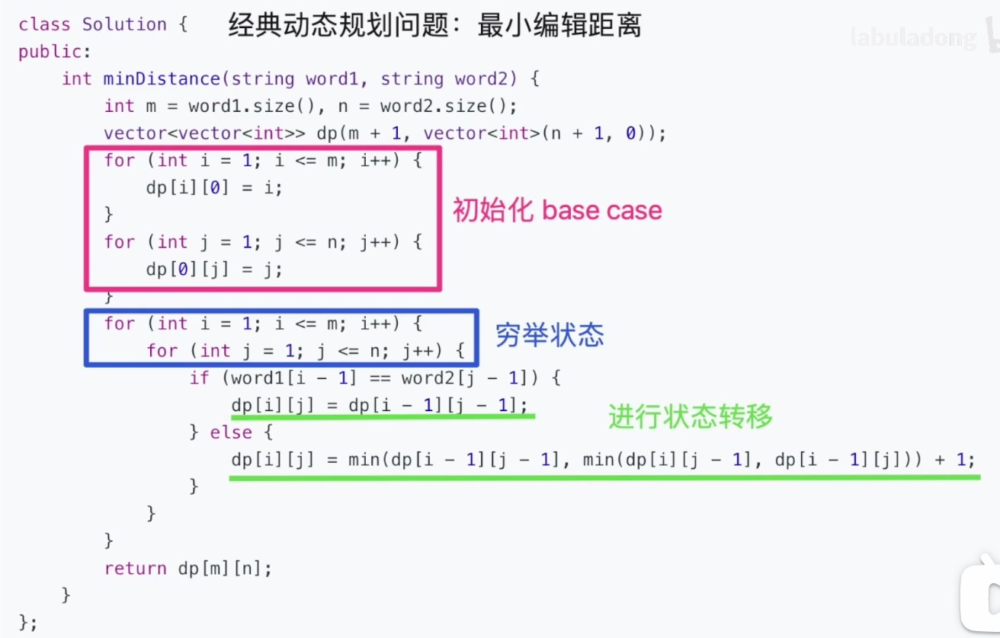

# 动态规划
把一个规模比较大的问题，分解为，较小规模的子问题。**动态规划的一般形式就是求最值**。

其核心就是**穷举**，因为要求最值，肯定要把所有可行的答案穷举出来，然后在里面找最值。

## 动态规划的特点
1. 重叠值问题：存在重复计算的问题
2. 状态转移方程（最关键）
3. 最优子结构


## 解题套路和代码框架
1. 明确「状态」
2. 明确「选择」
3. 明确 dp 函数/数组的定义
4. 明确 base case：就是初始化值

```python
# 初始化 base case
dp[0][0][...] = base

# 进行状态转移
for 状态1 in 状态1的所有取值：
    for 状态2 in 状态2的所有取值：
        for ...
            dp[状态1][状态2][...] = 求最值(选择1，选择2...)
```

套路代码都大致如下



### 斐波那契数列

严格来说不是正宗的动态规划问题， 因为他不是求最值问题，但是依然非常适合用这个算法


```javascript
function fibDp(n) {
  if (n < 1) return 0;
  if ([1, 2].includes(n)) return 1;

  const arr = new Array(n + 1).fill(0);
  arr[1] = arr[2] = 1;

  for (let i = 2; i <= n; i++) {
    arr[i] = arr[i - 1] + arr[i - 2]
  }
  return arr[n]
}
```


> **递归函数的时间复杂度怎么算**
>
> 递归函数调用的次数 x 递归函数本身的复杂度

