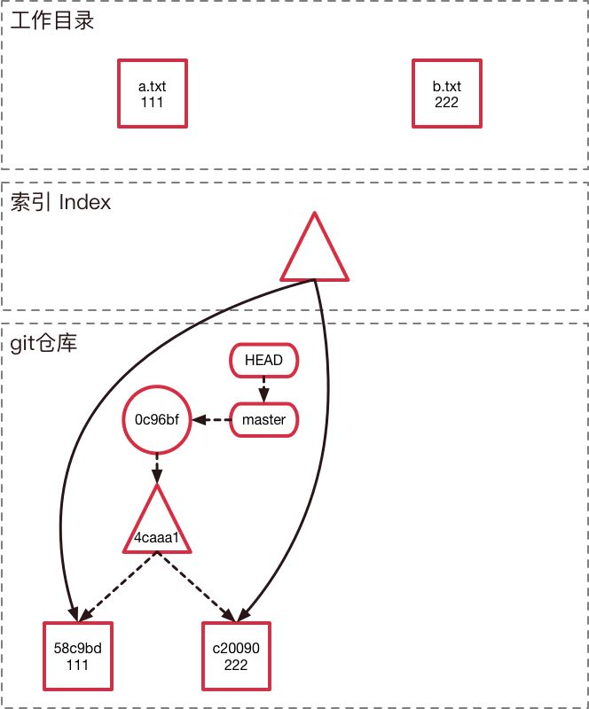
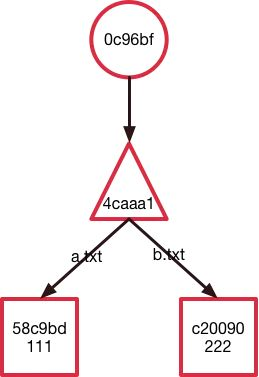
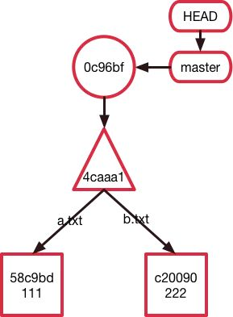

# 基础认知

## Git, GitHub与GitLab的关系

* Git是一个版本控制软件
* GitHub与GitLab都是用于管理版本的服务端软件
* GitHub有免费服务(代码需要公开)，以及付费服务(代码为私有)，国内访问速度慢
* GitLab用于在企业内部管理Git版本库。


## git 基础概念
| 名称         | 含义                                         |
| ------------ | -------------------------------------------- |
| repositories | 仓库，有几个开源项目就有几个仓库             |
| star         | 收藏                                         |
| fork         | 复制克隆别人的项目，该fork的项目是独立存在的 |
| pull request | 克隆别人的项目，做了修改之后发起更新请求     |
| watch        | 关注(会在第一时间收到你关注的项目更新的)     |
| issue        | 问题讨论区                                   |


## git工作区域

### 工作区
working Tree，就是在电脑中看到的目录如learning-notes 
涉及到的命令: echo a.md


### 暂存区
staged，暂存已经修改的文件最后统一添加到git仓库中
涉及到的命令：git add,git commit
执行git add 会发生的事情

执行git commit 


### 版本库
git repository，最终确定的文件保存到仓库中,别人才可以看到
版本库又分为**本地版本库** 和 **服务器版本库** 。`git push` 就是将本地版本库的内容推送到服务器版本库，`git pull` 就是将服务器版本库内容拉取到本地。


## git对象
使用
```bash
# 查看类型
git cat-file -t b335dda

# 查看具体内容
git cat-file -p b335dda

```
### blob(二进制对象)
这里面存储的：是文件的具体内容
git会将里面的内容 -> SHA1哈希算法 -> b335dda...


### tree
存储的是：目录结构、文件权限、文件名
一个tree对象，下面有任意个blob对象。也就是一个哈希值，下面有多个子节点


### commit
存储的是：上一个commit、对应快照、作者、提交信息
一个commit对象，下面有任意个tree对象，tree对象下面有任意blob对象



另一个需要注意的是：
HEAD、分支、普通的Tag可以简单的理解成一个指针，指向对应的commit的SHA1值
refs 存储的是：HEAD、分支、Tag
HEAD -> master -> commit



Git的大部分指令就是在操作这三个分区以及这条链


## QA
Q：每次commit，Git存储的是全新的文件快照，还是存储文件的变更部分？
A：全新的文件快照。原因是时间复杂度是 O(1)
