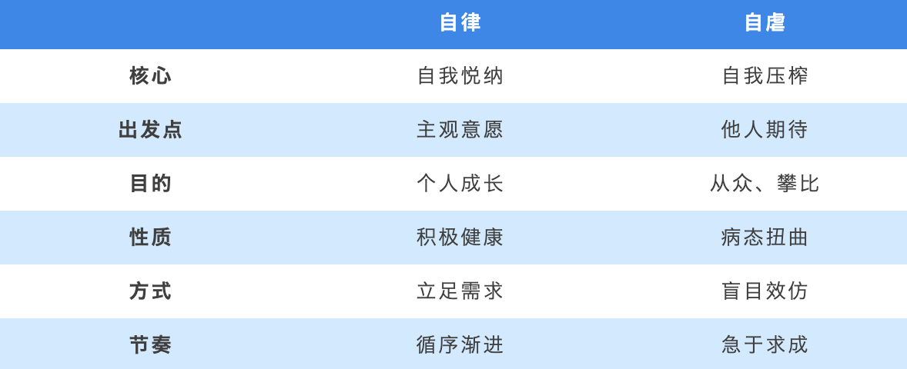

# 别让伪自律毁了你
一些话：
* 你凌晨四点半的图书馆吗？
* 你的舍友正在偷偷用功
* 再不努力，你的同龄人就要抛弃你了。

年轻人，不要假装努力，结果不会陪你演戏。你只会单纯地感动了自己。

## 如何定义自律

自律VS自虐

* 区别一：
    * 【自律】是基于主观自由意愿和独立价值判断的自我约束，其出发点是自我实现、个人成长等内在动机。 如：“我微胖的身材很漂亮，但我想要通过运动变得更健美。”
    * 【自虐】是依附于他人期待的形象展演，受好胜心、从众心、攀比心等外在因素驱动。 如：“同事又在秀他的八块腹肌，有什么了不起，我一定不能逊色于他。”

* 区别二：
    * 【自律】是一种发自内心的自我认同，倡导积极地看待自己的进步，享受事情本身。 如：“今天比昨天坚持的更久，我真酷！下班后吃顿大餐奖励自己的进步。”
    * 【自虐】是一种自我否定，以完成任务为导向，旨在逼迫自己达到指标，。 如：“其他同学一个月就学会了，唉，我的进度实在是太慢了，我真的好差劲。“

* 区别三：
    * 【自律】讲求循序渐进，依照科学的方法，遵循自己的节奏。 如：“减肥之路任重道远，先从少食多餐、戒掉零食开始吧。”
    * 【自虐】源于急于求成，盲目照搬他人经验，眼高手低，不自量力。 如：“女明星们为了维持身材只吃水煮菜，我还有什么理由吃尽情吃喝，我决定，从今天开始再也不吃肉了。“

* 区别四：
    * 【自律】是一种健康的生活态度，从小事起步，让优秀自然而然变成习惯。 如：“每天只需抽空背30个单词，日积月累，我的英语一定会有质的飞跃。”
    * 【自虐】是一种病态的自我压榨，对自己极度严苛，妄图一夜之间一步登天。 如：“只要肯吃苦，一个月时间突击刷完20000个单词不是梦。”

综上所述，我们不难发现，自律追求的是效率，是在愉悦的状态中自我驱动、自我提升；而“自虐”往往过分追求形式感，渴望通过自我惩罚填补内心的不安。

## 自律的正确打开方式

### 清晰的自我认知，树立明确的目标
事实上，专注力的缺失不仅仅归因于意志力薄弱，还可能是你的目标设定出了问题。

要改善这一现状，请先停下脚步，理性地分析现实，客观地评估自己。

接下来，仔细想想，做这件事情的初衷何在？那么拼命到底想要什么？期望达到什么目的？完成任务的迫切性如何？

基于以上的判断，你需要在自己的能力范围之内，划定一个可行的标准，并赋予这件事强烈的动机。这是因为：当你发自真心想要完成一件事且对自己有足够的信心时，这份内驱力会帮助你从容地抵抗外界诱惑，有力地战胜工作倦怠，将焦虑感转化为成就感。

那么，如何科学合理地制定目标呢？建议你参考SMART法则：
* Specific（具体的）：避免模糊，避免理想化，与其决定“成为一名厨艺高手”，不如把目标改成“每个月学会20道菜”。
* Measurable（可度量的）：具体的数量和指标有助于更好地评估进展、落实推进。比如，“每天跳绳30min”，而非“坚持跳绳”。
* Attainable（可实现的）：你的目标应基于能力而略高于能力，别急功近利，对于那些既无必要、又难达成的目标，要么舍弃，要么进行必要的调整，“一个月瘦5斤"要比“一周瘦5斤”更易落实执行。
* Relevant（相关的）：目标应与个人规划密切关联。认真审视你的自我需求，有意识地习得有关技能，假设你想成为一名律师，那么提升辩论水平的重要性远高于精通PS等多媒体软件。
* Time-based（有时限的）：给自己设置DDL，适度的压力与紧迫感能督促你更高效地完成任务。
P.S.　要注意的是，别为了自律而自律，自律不是我们的目标，而是实现人生目标的方式，切忌本末倒置。

## 积极的心理暗示
极的心理暗示能调节人内在的心智模式，使人迅速进入一种乐观的状态，这种状态可以带来认知、情感以及行为上的转变，并促使人变得更加镇定、觉察。

相反，紧张、烦躁、焦虑、恐惧等消极心理一旦被带入工作，很容易导致习得性无助，削弱你的自信心，分散你的注意力。

因此，想要更好地进行自我管理，健康的心态很重要，只有驾驭好你的潜意识，抛开抵触的负面情绪，才能专注于目标本身，与压力和平相处。

不妨试试这样：
* 着眼于自己的进步，肯定每一个微小的成就；
* 设定奖励机制，激发正向的内部反馈，强化专注意愿；
* 营造仪式感，提示自己尽快排除干扰，进入状态；
* 大声地肯定自己： “我今天的状态很棒！” “我一定可以做到！” “我可以再坚持一下。” “一切都会好起来的。”

## 遵循你的生理节律
一味地自加约束是远远不够的，你还需要遵循法度、量力而行。

所谓“度”，指的是你的生理节律。作为自然进化的结果，人类和其他一切生物都受生理节律的影响，从出生之日起，直到生命终结，我们的体力、情绪和智力都存在着周期性的变化：
* 处于高潮期时，体力充沛、精神焕发、思维敏捷、工作效率高；
* 处于低潮期时，疲劳困乏、情绪消沉、思维迟钝、记忆力下降。

“清晨五点起床、晚上十点就寝”未必是最健康的生活节奏，把日程表排得满满当当也不一定能最大程度地利用时间。自律的精髓绝不是比谁花的时间长，谁的工作量大，而是找寻自己的平衡，根据个人的体质灵活安排作息，一则充分利用个人潜能，避免不必要的自我消耗，二则合理分配精力，让生活张弛有度。

换言之，过度的自律不仅无益于效率的提升，还会对身体造成损害。想要更有效地工作，不如劳逸结合，每当感到精神疲惫、昏昏欲睡时，不如小憩片刻，为自己充充电，或许会有事半功倍的效果。

## 从小事开始
自律的痛点有两个：无法开始，难以坚持。

之所以有这样困扰，是因为人性是回避痛苦、追求即时满足的，在自律的过程中，如果你的目标遥不可及，难免会心生畏惧与倦怠，背离自律的初心。

如何克服人性的弱点，请遵循这两大原则：

* 戒掉偏执的完美主义，正视自己的极限，调低期望值。
* 切割你的目标，将宏大的愿景细分为力所能及的小事。如果你打算锻炼自己的英语能力，首先，将目标具体为“每天学英语1H”，接着，将其拆分为几个微不足道的部分：背单词10min、精读外刊15min、练习听力15min……这样，你无需牺牲太多即可轻而易举地完成一个任务。

事实证明，可持续的、无需费力的、顺其自然的自律，才是真正有益处的自律。上述方法能十分有效地减少行动的阻力，引导你一点点脱离舒适区。因为付出的代价足够小，你很容易就能长期坚持下去。

除此之外，在打卡一个又一个微目标后，自我实现的成就感会大大提高你的自我效能感，刺激你与日俱进，达成更多。

所谓自律，不是在不喜欢、不情愿、不享受、不擅长的状态下透支身体、自我打压、盲目努力、苦苦坚持，而是以积极主动的态度恰当地约束自己，并凭借强大的意志力去制定一套属于自己的做事原则，建立稳定规律的良性秩序。

