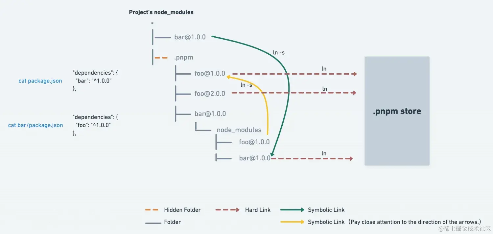

# 基础使用

## pnpm 的优势

### 节约磁盘空间

pnpm 在安装包的时候，都会把包放在 "store" 的目录下，每个包都是一个单独的文件夹。在当软件包被被安装时，包里的文件会硬链接到这一位置，而不会占用额外的磁盘空间

场景示例：假设你有两个项目：Project A 和 Project B，它们都依赖同一个版本的 lodash。

**使用 npm：** 在 Project A 中安装 lodash，会在 Project A 的 node_modules 目录下创建一个 lodash 的文件夹，并将 lodash 的文件复制到该文件夹中。在 Project B 中安装 lodash，同样会在 Project B 的 node_modules 目录下创建一个独立的 lodash 文件夹，并将 lodash 的文件复制到该文件夹中。这导致 lodash 在磁盘上存在两份副本。

**使用 pnpm：** 在 Project A 中安装 lodash，会在 pnpm store 中创建一个 lodash 的文件夹，并将 lodash 的文件存储在其中。在 Project B 中安装 lodash，pnpm 会使用硬链接将 Project B 中的依赖项链接到 store 中的 lodash 文件夹。这样，Project B 实际上共享了 Project A 中已经安装的 lodash 文件夹，而不需要复制文件。通过符号链接的方式，pnpm 可以最大化地共享和复用依赖项的文件，从而节省磁盘空间。这对于同时管理多个项目或有大量依赖项的项目特别有用。

安装多个版本时只会将不同版本间有差异的文件添加到仓库

### 提高安装速度

pnpm 安装包分为 3 个阶段

- 依赖解析。仓库中没有的就获取到仓库中
- 目录结构计算。node_modules 目录结构是根据依赖计算出来的
- 链接依赖项。以前安装过的就直接从仓库中获取并链接到 node_modules 中。

npm 安装包也分为 3 个阶段

- 依赖解析
- 获取依赖
- 将所有的依赖写入到 node_modules 中

npm 是依次执行，pnpm 是并行的。

### 创建一个非扁平的 node_modules 目录

npm 所有的包都会提升到根目录，导致的问题是源码可以直接访问和修改依赖。

pnpm 默认是树状结构， 使用**符号链接**将项目的直接依赖项添加到模块目录的根目录中

这个符号链接指向了 .pnpm 中下的这个依赖，而这个依赖又是通过硬链接的方式链接到 pnpm store 仓库。

为啥后面一步要使用硬链接

- 如果原始文件被删除或移动，软链接就会指向一个失效的引用，导致无法加载到正确的库。
- pnpm 使用一个内容寻址的存储方式，意味着包的内容直接与它在存储中的位置相映射。如果你在项目 A 的依赖中做了修改，那么这会破坏内容寻址的映射，因为修改后的内容与原本的存储位置不再匹配。

硬链接更像是为文件创建了另一个相同的入口，而软链接更像是创建了一个指向原文件的快捷方式

内容寻址是说：每个文件都计算 hash 值，在安装的时候看这个 hash 值的文件在不在，如果不在，那么就安装。如果在就创建一个硬链接。

- 内容寻址示例文件名 `/Users/xingya/Library/pnpm/store/v3/files/00/04d874780f42ebc2f95125b8221932385f4293c5040deeee4e1c59136e66c6fb636ed93e104e6388955919ffc0f9ad4d7316b4918465a2ad9fa171c746acb8`



## 常用命令

### 管理依赖

| 命令                     | 作用                                               |
| ------------------------ | -------------------------------------------------- |
| `pnpm i/install`         | 安装项目的所有依赖                                 |
| `pnpm add sax`           | 安装 npm 包到 dependencies                         |
| `pnpm add -D sax`        | 安装 npm 包到 devDependencies                      |
| `pnpm add -g sax`        | 全局安装 sax                                       |
| `pnpm add sax@3.0.0`     | 安装指定版本                                       |
| `pnpm rm/remove sax`     | 删除依赖 (rm)                                      |
| `pnpm up/update [sax]`   | 更新所有依赖、某个包                               |
| `pnpm update --latest`   | 更新所有依赖到最新版本，无视 package.json 中的规则 |
| `pnpm link --global`     | link 项目的依赖到全局                              |
| `pnpm link --global foo` | Replace foo with a local version of it             |
| `pnpm import`            | 把别的 lock 文件转成 pnpm lock                     |
| `pnpm prune`             | 去掉没用到的依赖                                   |

### 查看依赖

| 命令                                  | 作用                                                          |
| ------------------------------------- | ------------------------------------------------------------- |
| `pnpm ls [sax]`                       | 列出已安装的包和其依赖关系。默认指展示顶层的依赖              |
| `pnpm ls [sax] --depth 10 / Infinity` | 增加搜索的深度。默认指展示顶层的依赖，Infinity 列出所有依赖项 |
| `pnpm ls -g`                          | 查看全局安装的包                                              |
| `pnpm why [sax]`                      | 查看为什么 sax 这个包会被安装                                 |
| `pnpm outdated`                       | 查看过期的包                                                  |

| 命令                           | 作用                          |
| ------------------------------ | ----------------------------- |
| `pnpm view axios versions`     | 查看 axios 所有可用版本       |
| `pnpm view axios dependencies` | 查看 axios 的依赖依赖了哪些包 |

### 运行脚本

#### pnpm run

执行 scripts 中定义的命令

| 命令          | 作用              |
| ------------- | ----------------- |
| `pnpm run []` | 其中 run 可以省略 |

#### pnpm exec

在项目的范围内执行 shell 命令。`node_modules/.bin` 里面的命令都可以使用

它可以使用全局安装和项目级别安装的依赖的命令。

```bash
pnpm exec jest
```

当 exec 部分与内置的 pnpm 命令不冲突时，它实际上是可选的，所以你也可以直接运行

```bash
pnpm jest
```

还有一个用途：如果项目是 monorepo，每个子模块都有自己的 package.json 文件和 scripts 字段定义了一些特定的命令。如果你想在根目录中一次性运行所有子模块的特定命令，而不需要进入每个子模块执行相同的命令。

#### pnpm dlx

不安装依赖，从 pnpm 注册表中获取这个依赖，执行依赖的二进制命令。执行完之后会将其清除掉。

```bash
pnpm dlx create-umi@latest
```

### 其他

| 命令                                         | 作用                     |
| -------------------------------------------- | ------------------------ |
| `pnpm store path`                            | 查看 store path          |
| `pnpm --filter <package_selector> <command>` | 过滤选择包，然后执行命令 |
| `pnpm install-completion [zsh]`              | 自动补全                 |

## workspace

pnpm 内置了对单一存储库（也称为多包存储库、多项目存储库或单体存储库）的支持， 你可以创建一个 workspace 以将多个项目合并到一个仓库中。

一个 workspace 的根目录下必须有 pnpm-workspace.yaml 文件

```yaml
packages:
  - 'packages/*'
```

### 为啥要使用 monorepo

- 安装依赖的时候不需要去多个目录中去安装，可以一次性安装所有子包的依赖
- 公共的依赖不用安装多次。公共的依赖会被安装到外层
- 可以把多个包都会用到的工具、方法等放到一个公共的包里面。可以在另外的包中引用这个包。

### 包管理

#### pnpm add

--workspace Only adds the new dependency if it is found in the workspace

-w, --workspace-root Run the command on the root workspace project

```bash
pnpm add -wD typescript

pnpm --filter packageA add -D lodash // 开发依赖

```

#### 删除所有的包

```bash
pnpm exec rm -rf node_modules --recursive
```

### 发布工作流

workspace 中的包版本管理是一个复杂的任务，pnpm 目前也并未提供内置的解决方案。 不过，有两个不错且支持 pnpm 的版本控制工具可以使用：

- changesets

#### changesets

主要做了两件事情

- 修改版本号
- 生成changelog

```bash
pnpm add -wD @changesets/cli

pnpm changeset init

pnpm changeset

pnpm changeset version

pnpm install

git commit -m "Release v0.0.1"

pnpm publish -r
```

## 其他

### pnpm setup

- 检查 PATH :pnpm 会查看系统的 PATH 环境变量是否已经包含了指向 pnpm 全局二进制文件的路径
- 修改 Shell 配置：自动向配置文件增加配置
- 设定 PNPM_HOME。

### PNPM_HOME 的作用

指定全局安装包和和全局命令的二进制文件的位置。

在安装全局包或者设置全局命令时，pnpm 需要知道这些文件存放在什么位置。
