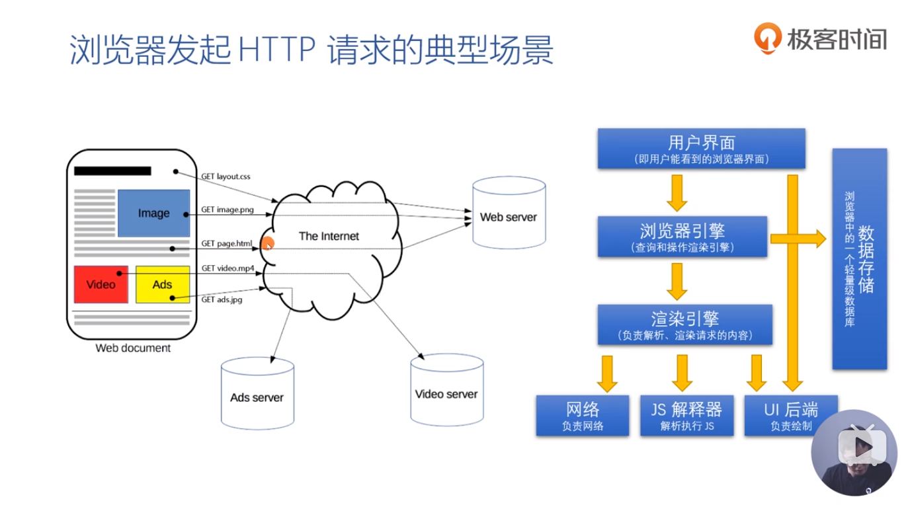
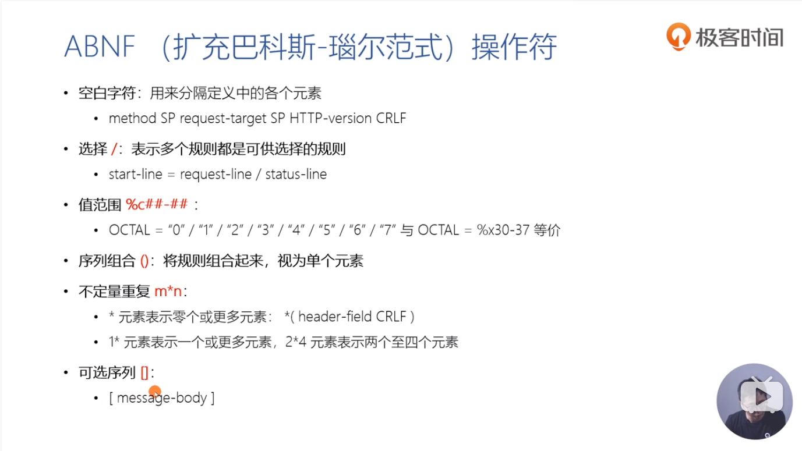
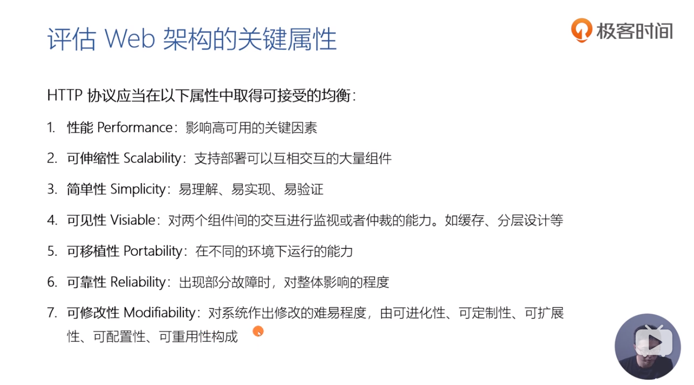
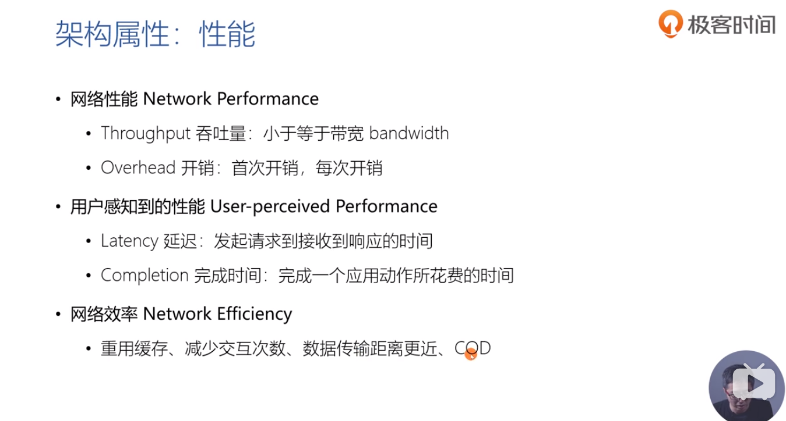

# Http基础

## 浏览器发起HTTP请求的典型场景

* 当用户在地址栏中输入url的时候，浏览器的自动补全功能是由于浏览器有一个轻量级的数据库，所以可以根据历史记录来猜测用户想要输入的地址
* 当发起请求的时候，就会调用渲染引擎。
* 发出第一个请求，等到HTML响应回来之后，如果发现有相关联的如超链接、JavaScript请求，图片等，就会自动发送请求，然后请求回来之后，再调用js解析器执行js
* 拿到所以请求之后，通过ui后端，把完整的界面绘制到用户界面

背后细节

## HTTP协议的定义

一种无状态、应用层、以请求/应答方式运行的协议。它使用可拓展的语义和自描述消息格式，与基于网络的超文本信息系统灵活的互动

## Http协议格式、语法

## HTTP解决了什么问题

解决了WWW信息交互必须面对的需求

* 低门槛
* 可拓展性
* 分布式系统下的大颗粒的超媒体资源
* Internet规模
* 向前兼容

## 评估web架构的七个关键属性

