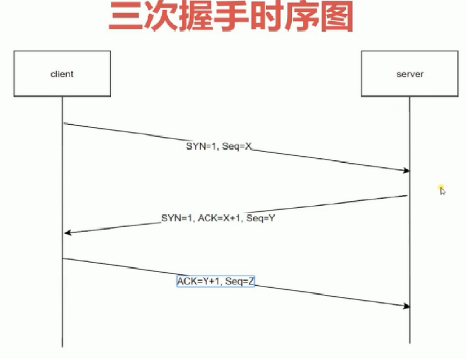

# Http协议基础

## 前置知识

### 经典的五层模型

| 名称       | 关键词                                                       |
| ---------- | ------------------------------------------------------------ |
| 应用层     | HTTP/FTP                                                     |
| 传输层     | TCP/UDP 数据的分片和组装                                |
| 网络层     | IP，DNS                                                      |
| 数据链路层 | 在通信的实体间建立数据链路连接 物理设备已经通过物理层创建了连接 通过软件创建电路的连接用来传输数据(基础的就是 0 1) |
| 物理层     | 定义物理设备如何传输数据，网卡，网线，端口，光缆 硬件设备相关的东西 |

> 说明：一次TCP连接可以发送一个或者多个http请求

### TCP建立连接的三次握手

说明：

* SYN是同步（标志位)，其中 1为是，0为否，
* Seq是序号，数据包本身的序列号
* ACK是期望对方继续发送的那个数据包的序列号。第三次Seq = X+1
* ACK是对收到的数据包的确认，值是等待接收的数据包的序列号。

为什么需要三次握手？

* 防止服务端开启一些无用的连接。
* 如果只有两次握手那么可能因为网络原因客户端没收到，然后客户端就会发送创建新的连接的请求，而这个时候服务端就会再新建一个连接，这就导致了服务端开启了无用的连接
* 维持序列号

### URI和URL

* uri：统一资源标识符，身份证号码
* url: 统一资源定位符，身份证号+住址

## http使用场景
* REST = http协议 + json
* API = http + json/xml
* webservice = http协议 + XML

## 什么是http协议

http协议就是客户端，服务端按照一定的规则进行交流，客服端按照一定的规则发送请求，服务端按照一定的规则发送响应数据

## http报文格式

在Chrome中

General就是起始行

## 请求分为两种

简单请求和非简单请求

什么是简单请求?

> （1) 请求方法是以下三种方法之一：
>
> - HEAD
> - GET
> - POST
>
> （2）HTTP的头信息不超出以下几种字段：
>
> - Accept
> - Accept-Language
> - Content-Language
> - Last-Event-ID
> - Content-Type：只限于三个值`application/x-www-form-urlencoded`、`multipart/form-data`、`text/plain`

同时满足这两个要求的就是简单请求。

对于非简单请求，浏览器就会先发送一次预请求，方法是Options

## 跨域问题

跨域是浏览器的拦截机制，要说明的是

* 请求已经发送了
* 服务器也返回了数据
* 浏览器没看到Access-Control-Allow-Origin，就把请求返回的内容忽略掉，并且报错

解决方案：

| 方法 | 说明                                                         |
| ---- | ------------------------------------------------------------ |
| CORS | 在服务端设置`'Access-Control-Allow-Origin': '*'` CORS这种方式只要在服务器端设置这个即可 这里还可以设置的有 `'Access-Control-Allow-Headers': 'X-Test-COrs'`， `'Access-Control-Allow-Methods': 'POST,PUT,DELETE'`， `'Access-Control-Max-Age': 1000` |
|      |                                                              |

## Cache-Control

1. 可缓存性
   - public  http经过的任何地方就可以加上缓存
   - private  只能发起请求的浏览器才可以缓存
   -  no-cache  不可以进行缓存
2. 到期
   * max-age = <seconds>  设置有效时长
   * s-maxage = <seconds>  为代理服务器设置
   * max- stale=<seconds>   表示超过了有效期也可以使用缓存的时间。客户端设置
3. 重新验证
   * must-revalidate 过期之后，必须重新发送请求验证，而不能直接使用缓存
   *  proxy- revalidate 指定缓存服务器过期了，必须到原服务器再次发送请求
4. no-store 不允许使用缓存
5. no-transform 不允许中间服务器对发起的请求做改动
6. 前端使用缓存，但是服务端有变化了又能去请求服务器怎么操作
   * 使用webpack打包时，在js文件名上加上hash码

## Content-Type

请求的与实体对应的MIME信息

| 请求头        | 解释 | 示例 |
| ------------- | ---- | ---- |
| Last-Modified |      |      |
|               |      |      |
|               |      |      |

