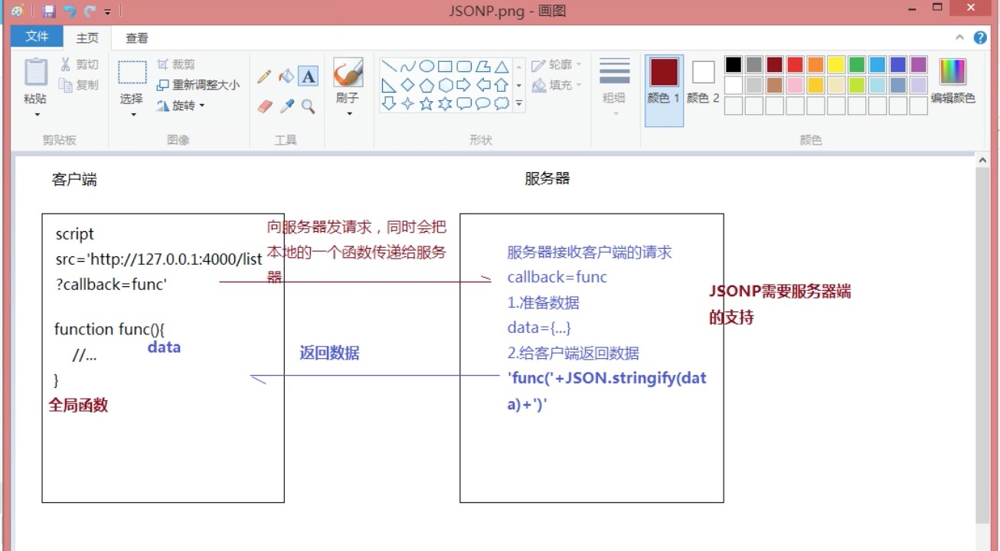

# 跨域
跨域是浏览器的安全策略阻止我们跨域，不是服务器阻止我们跨域。

要说明的是:
* 请求已经发送了
* 服务器也返回了数据
* 浏览器没看到 `Access-Control-Allow-Origin`，就把请求返回的内容忽略掉，并且报错


## 同源策略
`协议` + `域名` + `端口` 都相同 只有路径不同才能称作同源。


常见的协议如：`http`｜`https` 

域名的定义
是由一串用点分割的名字组成的计算机组的名称，用于在数据传输时对计算机的定位标识。

IP 地址很难被记忆，且可能会随着时间的推移发生改变。比如百度的IP（112.80.248.75）你可以用它来访问，但是你确定你记得住吗？玩意它变了呢？

域名的结构
域名需要从右到左阅读。

```bash
developer.mozilla.org
```
其中 `org` 被称为**顶级域名** <abbr title="Top-Level Domain">TLD</abbr>。也被称为一级域名。 常见的顶级域名还有：`.com` <small>供商业机构使用，但无限制，最常用</small> 、`.net` <small>原供网络服务供应商使用，现无限制</small> 、

刚好位于 TLD 前面的也被称为**二级域名**。在这里 mozilla 就是二级域名。

子域名
mail.example.com 和 calendar.example.com 是 example.com 的两个子域，而 example.com 则是顶级域名 .com 的子域。


### 同源策略存在的意义
保证用户信息安全，防止用户的信息被恶意的窃取。所以浏览器为了达到保护的目的，对很多不同源的操作做了很多限制，主要分为几个方面
* 数据存储方面：不同源之间 `Cookie`,`localStorage`,`IndexDB` 是无法相互读取的。
* DOM 方面：不同源之间是无法操作彼此的 `DOM` 的。
* 数据请求方面：不同源之间是无法通过 `ajax` 进行数据请求和交换的。

浏览器中的大部分内容都是受同源策略限制的，但是以下三个标签可以不受限制：
* `<script src=XXX>`
* ``
* `<link href=XXX>`
* `<iframe>`


## 为什么会有跨域
1. 为了性能优化，会把服务器进行拆分，比如分为
    * web 服务器：静态资源 kbs.sports.qq.com
    * data 服务器：业务逻辑和数据分析 api.sports.qq.com
    * 图片服务器
2. 调用第三方 api 接口
    * 比如百度地图接口呀，天气接口等

这种情况下，部署到线上，也会存在跨域问题。


## 如何实现跨域
如果最终线上部署的时候，是部署在同一服务器，那么它们最后不会出现跨域问题


### 修改本地host
修改本地 host 这样可以使得 域名相同。
```bash
11.159.44.46 buffett.caijing.alibaba.net   

# 在页面访问的地址如下
http://buffett.caijing.alibaba.net/
```
这样就不会有跨域问题。
这种方式在本地开发的时候，就采用这种方式进行模拟。
这种其实不是真正的跨域，因为在上线部署的时候，它们会部署在同一个服务器上。


### JSONP
浏览器中的大部分内容都是受同源策略限制的，但是以下三个标签可以不受限制：
* `<script src=XXX>`
* ``
* `<link href=XXX>`
* `<iframe>`

jsonp 就是利用这种特性实现跨域
原理示例图如下

`jsonp` 原理文字描述如下：
`jsonp` 利用 `<script src=XXX>` 不受同源策略限制的特点，在向后端发请求的时候，会多拼接一个全局函数 <small>这里叫它 `callback`</small> ,然后和后端约定好，让其把数据放在 `callback(data)` 里面，浏览器会把字符串变成 JS 表达式执行。然后前端就可以在 `callback` 里面拿到后端返回数据。
动态生成 script 标签


要点：
* 需要后端配合
* 只能处理 `GET` 请求

存在的问题
* JSONP 只能处理 `GET` 请求
* 安全问题(url劫持，后端返回结果被劫持)


### CORS
`Cross-Origin Resource Sharing`: 跨域资源共享

`CORS` 方式只要在服务器端做如下设置：
```bash
Access-Control-Allow-Origin: *

# 也可以只允许某些网站
Access-Control-Allow-Origin: 'http://localhost:4444/'
```
 

这里还可以设置的有:
```bash
Access-Control-Allow-Headers: X-Test-COrs
Access-Control-Allow-Methods: 'POST,PUT,DELETE'
Access-Control-Max-Age: 1000
```

这种方式的特点
* 只需要后端设置 `Access-Control-Allow-Origin`，前端不用做处理

缺点：
* 只能设置 `Access-Control-Allow-Origin` 为 `*` 或者 某一个具体地址。 
    * 当为 `*` 的时候，不可以携带 *cookie*
    * 当为 具体地址 的时候，可以携带 *cookie*


### Proxy
这个要依赖 `webpack` 和 `webpack-dev-server`
这里你看到了是 `devServer`，也就是说线上不能通过这种方式了
```javascript
devServer: {
  proxy: {
    '/': {
      target: 'http://11.159.44.46', // 后端地址
      changeOrigin: true, // 设置这个，表示可以跨域
    }
  }
}
```
特点：
* 只需要前端做处理


### 中间服务器代理
使用场景：
* 需要访问的服务器是第三方的，人家不允许你 `CORS`，这时候你就没办法让人家给你设置访问白名单
* 需要进一步处理 第三方服务器返回的数据，然后再响应到客户端


同源策略是浏览器需要遵循的标准，而如果是服务器向服务器请求就无需遵循同源策略。
它分为一下几步
1. 接受客户端请求
代理服务器，直接和浏览器直接交互，**也需要设置：CORS 的首部字段即：`Access-Control-Allow-Origin: *`**。这样浏览器就可以我们的代理服务器无障碍沟通啦。

2. 将请求转发给目标服务器
代理服务器将请求转发给目标服务器，服务器之间没限制

3. 拿到目标服务器响应数据
代理服务器拿到目标服务器的数据

4. 将 响应 转发给客户端(浏览器)
代理服务器将数据转发到客户端。


### Nginx 反向代理
特点：不需要前端处理


### websocket
Websocket 是 HTML5 的一个持久化的协议，它实现了浏览器与服务器的全双工通信、同时也是跨域的一种解决方案 

### Post Message
有更好的方式，暂无用到此种方法

### 基于 iframe 的跨域：

