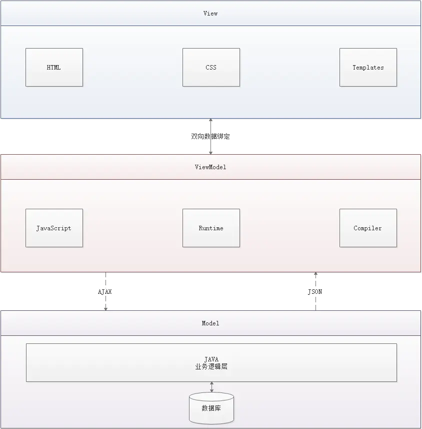
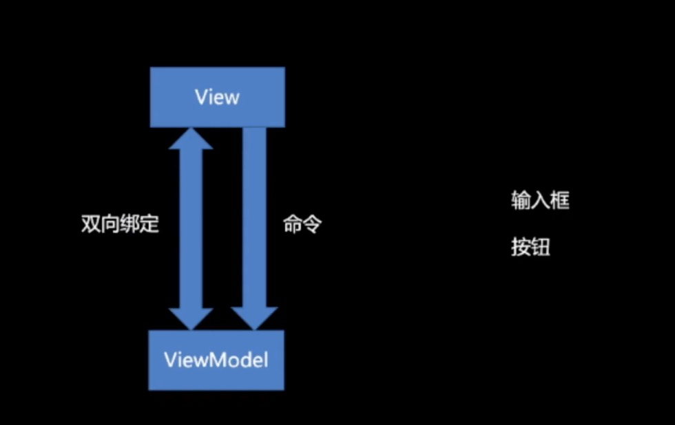

# MVVM
英文：Model-View-ViewModel

> 维基百科中给出的定义
> 模型是指代表实际状态内容的领域模型（一种面向对象的方法），或指代表内容的数据访问层（以数据为中心）
> 
> 
> 


## 架构详解
图1


图2


### Model
数据。对前端来说就是 JS 对象。（不用关心 View）

数据处理模型


```typescript
const data = {
  name: 'gengdezhou',
  age: 18,
  friends: ['singleDogA', 'singleDogB'],
  details: {
    type: 'notSingleDog',
    tags: ['fff', 'sox']
  }
}
```


### View
视图界面。对前端来说就是 HTML ，可以输入并做出反馈（不用关心 Model）。
View(视图层)，负责维护 UI 结构和样式，同时负责与 ViewModel（视图模型）做数据绑定，这里的数据绑定关系是双向的，也就是 ViewModel 的数据发生变化，会触发 View 的更新，同时视图层的数据变化又会触发 ViewModel 的变化。

其数据来源是 ViewModel。

View 指的是用户界面。有可能是图形化的用户界面（GUI），也可能不是，如、智能音箱、对讲机等。
```html
<div>
  <p>
    <b>name: </b>
    <span>gengdezhou</span>
  </p>
  <p>
    <b>age: </b>
    <span>18</span>
  </p>
  <ul>
    <li>singleDogA</li>
    <li>singleDogB</li>
  </ul>
  <div>
    <p>notSingleDog</p>
    <ul>
      <li>fff</li>
      <li>sox</li>
    </ul>
  </div>
</div>

```


### ViewModel
ViewModel（视图模型）
* 对获取到的 Model 数据进行转换处理，做二次封装，以生成符合 View 层使用的视图数据层。
* 连接 M 和 V 的桥梁。包括**视图的状态和行为**两部分，
  * 页面的这一块展示什么，那一块展示什么，这些都属于**视图状态**
  * 页面加载什么，点击之后会发生什么，滚动会发生什么，这些都属于**视图行为**

实现了双向绑定，ViewModel 的内容会实时展现在 View 层，


### View 和 ViewModel



View 和 ViewModel 的两种交互方式

1. 双向绑定（输入框这种）
2. 命令（按钮）


## 好处

目的是：分离视图（View）和模型（Model）。

* 低耦合：View 可以独立于 Model 变化和修改，一个 ViewModel 可以绑定到不同的 View 上，当 View 变化的时候，Model 可以不变，当 Model 变化的时候 View 也可以不变

* 可复用：可以把一些视图逻辑放在一个 ViewModel 中，可以让很多 View 复用这些逻辑

* 独立开发：开发人员可以专注于业务逻辑和数据的开发（ViewModel），设计人员可以专注于页面设计

* 可测试性：界面素来是比较难以测试的，而现在测试可以针对 ViewModel 来写

  

## MVVM 的原理

### 实现方式
实现的方式有多种。

#### 数据劫持
Vue 的实现方式就是这种，对数据进行劫持，当数据发生变动时会触发劫持时绑定的方法，对视图进行更新。

#### 脏检查机制
Angular 的实现方式，当发生了某种事件（例如输入），Angular 会检查新的数据结构和之前的数据结构是否发生了变动，来决定是否更新视图。


#### 发布订阅模式
Knockout 实现一个发布订阅器，解析时会在对应视图节点绑定订阅器，在数据上绑定发布器，当修改数据时，就触发了发布器，视图收到后进行对应更新。


### 实现步骤
1. 解析模版
2. 解析数据
3. 绑定模板与数据

#### 解析模板

```html
<!-- Vue -->
<div id="mobile-list">
  <h1 v-text="title"></h1>
  <ul>
    <li v-for="item in brands">
      <b v-text="item.name"></b>
      <span v-show="showRank">Rank: {{item.rank}}</span>
    </li>
  </ul>
</div>
<!-- Angular -->
<ul>
  <li ng-repeat="phone in phones">
    {{phone.name}}
    <p>{{phone.snippet}}</p>
  </li>
</ul>
<!-- Knockout -->
<tbody data-bind="foreach: seats">
  <tr>
    <td data-bind="text: name"></td>
    <td data-bind="text: meal().mealName"></td>
    <td data-bind="text: meal().price"></td>
  </tr>    
</tbody>
```
他们都定义了自己的模板关键字，这一模块的作用就是根据关键字解析模版，将模版对应到期望的数据结构。


#### 解析数据
Model 中的数据经过劫持或者绑定发布器来解析。数据解析器的编写要考虑 VM 的实现方式，但是无论如何解析数据只要做好一件事：定义数据变动时要通知的对象。解析数据时应保证数据解析后的一致性，对各种数据结构解析后暴露的接口应该保持一致。


### 绑定模版与数据

这一部分定了数据结构以何种方式和模版进行绑定，就是双向绑定。绑定之后我们直接对数据进行操作时，应用就能自动更新视图了。数据和模版往往是多对多的关系，而且不同的模版更新数据的方式往往不同。例如有的是改变标签的文本节点，有的是改变标签的className。


## 解读
* MVVM 应该改成 M-VM-V 会更容易理解。View-Model 作为胶水层，把「视图 View」 和「数据模型 Model」粘合在一起。
* MVVM 不是一个纯前端的架构模式。它适用于所有的包含GUI（Graphical User Interface 图形用户接口）的应用程序中（包括后端部分）
* 我们之所以要发明这种分层架构，最主要的原因是为了让 Model 层和 Controller 层能够复用。甚至于对于同一款应用程序在不同的 GUI 上进行展示时，View-Model 层也是复用的，仅仅只是把 View 层进行了替换而已。
* MVVM 其实可以细分为 M-C-VM-V 的四层架构。
    * M(odel)层：定义数据结构，建立应用的抽象模型。
    * C(ontroller)层：实现业务逻辑，向上暴露数据更新的接口，调用Model层来进行模型数据的增删改查，以达到应用数据更新的目的。
    * V(iew)-M(odel)层：将Model层的抽象模型转换为视图模型用于展示，同时将视图交互事件绑定到Controller层的数据更新接口上。
    * V(iew)层：将视图模型通过特定的GUI展示出来，并在GUI控件上绑定视图交互事件。
* 假如我们的应用程序需要在非GUI界面进行实现，而是通过其他UI方式来实现呢？只需要将View-Model层替换成新的UI-Model，再与新的UI进行桥接，同样的功能便可以跨UI进行实现了。举个例子：针对于残障人士（比如盲人），我们的应用程序应该更加方便易用。或许我们需要考虑使用扬声器来代替显示器进行输出，同时使用麦克风来进行输入。这时，我们可以将上述的View-Model替换为Audio-Model作为语音模型，UI层即Audio层用于播放语音和接收语音输入。
* 综上所述，对于UI应用程序（给用户提供了用户接口的应用程序），都可以抽象成M-I-IM（其中I指Interface）架构模式来达到模型、逻辑、表征之间的分离解耦，并提高开发效率。
