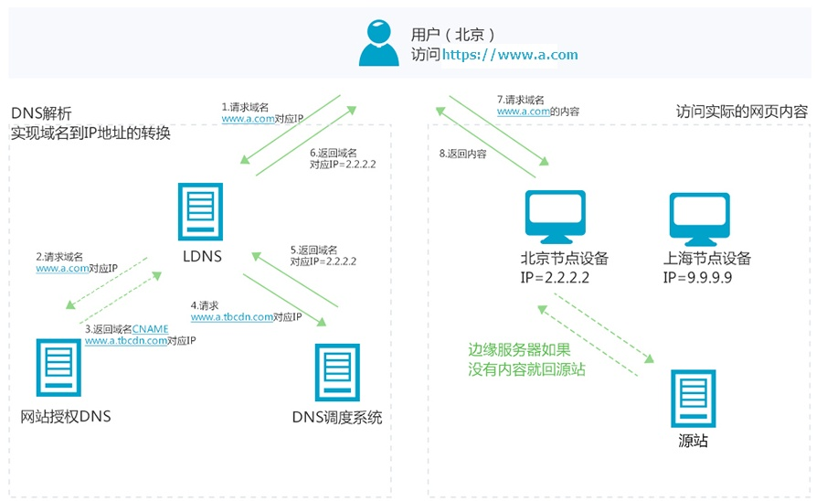

# CDN
**CDN 是（Content Delivery Networks） 内容分发网络**
CDN 是 一组分布在不同地理位置的 web 服务器，用于更加有效的向用户发布内容

## 目的
使用户可就近取得所需内容，解决 Internet 网络拥挤的状况，提高用户访问网站的响应速度。

## 具体说明
举个例子：
1. 当我们在浏览器搜索栏搜索 www.baidu.com 的时候，会先通过 DNS 域名解析拿到 对应的 IP
2. 这个 IP 对面对应的一大堆的服务器，也就是服务器集群，当我们在安徽访问时，就会让我们跳转到离你最近的安徽省的服务器，当在北京访问的时候，就会跳转到北京附近的服务器。这就是 CDN 的作用之一 **分流**。这也叫 **负载均衡**
3. 当百度的CDN 识别出这是一个攻击性请求时，就不会去请求转发。这是 CDN 的另一个好处 抵御攻击

这样的好处是：
当一个机器进行升级或者坏了，那么可以让 CDN 转到别的服务器去

## CDN 工作原理
广泛采用各种缓存服务器，将这些缓存服务器分布到用户访问相对集中的地区或者网络中，在用户访问网站时，利用全局负载均衡技术将用户指向距离最近的工作正常的缓存服务器上，由缓存服务器直接相应用户请求

假设通过 CDN 加速的域名为 www.a.com，接入 CDN 网络，开始使用加速服务后，当终端用户（北京）发起 HTTP 请求时，处理流程如下：
1. 当终端用户（北京）向 www.a.com 下的指定资源发起请求时，首先向 LDNS（本地 DNS）发起域名解析请求。
2. LDNS 检查缓存中是否有 www.a.com 的 IP 地址记录。如果有，则直接返回给终端用户；如果没有，则向授权 DNS 查询。
3. 当授权 DNS 解析 www.a.com 时，返回域名CNAME www.a.tbcdn.com 对应IP地址。
4. 域名解析请求发送至阿里云 DNS 调度系统，并为请求分配最佳节点 IP 地址。
5. LDNS 获取 DNS 返回的解析IP地址。
6. 用户获取解析 IP 地址。
7. 用户向获取的 IP 地址发起对该资源的访问请求。

* 如果该 IP 地址对应的节点已缓存该资源，则会将数据直接返回给用户，例如，图中步骤 7 和 8，请求结束。
* 如果该 IP 地址对应的节点未缓存该资源，则节点向源站发起对该资源的请求。获取资源后，结合用户自定义配置的缓存策略，将资源缓存至节点，例如，图中的北京节点，并返回给用户，请求结束。

