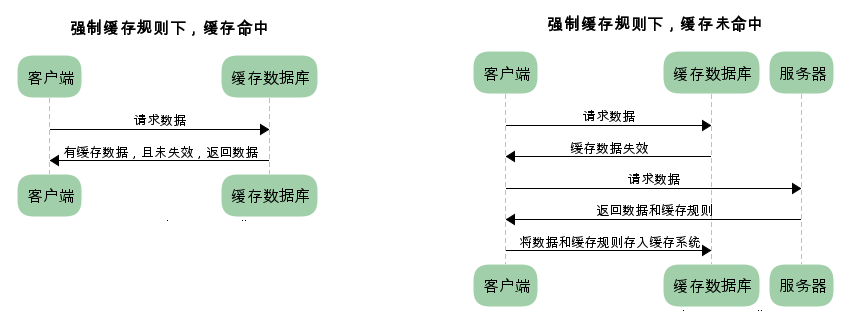

# 缓存
[toc]

## 缓存分类：
按照缓存位置分类：
* memory cache
* disk cache
* Service Worker

按照缓存策略分类：
* 强制缓存
* 对比缓存（协商缓存）


## 按照缓存位置分类
在浏览器的开发工具中 Network -> Size 一列看到一个请求最终的处理方式：如果是大小（多少K，多少M等)就表示是网络请求。否则会列出 `from memory cache`,`form disk cache` 和 `from ServiceWorker`。
优先级是：（由上到下寻找，找到就返回，找不到就继续）
1. Service Worker
2. Memory Cache
3. Disk Cache
4. 网络请求


### memory cache
mermory cache 是内存中的缓存，（与之对应的 disk cache 就是硬盘上的缓存）。先读内存，再读硬盘。
几乎所有的网络请求资源都会被浏览器自动加入到 memory cache 中。数量很大，所以它只能是一个「短期存储」。
常规情况下，浏览器的 TAB 关闭后该次浏览的 memory cache 便失效了。（给其他的TAB腾出位置）。而如果极端情况下（例如一个页面的缓存就占用了超级多的内存），那可能在TAB没关闭之前，排在前面的缓存就失效了。
memory cache机制保证了一个页面如果有两个相同的请求（例如两个src 相同的 img; 或者 两个href相同的link)都实际只会被请求一次。
在从 memory cache 获取缓存内容时，浏览器会忽略 `max-age-0`,`no-cache`等头部配置。`max-age=0` 在语意上解读为：*不要在下次浏览时使用*
如果真的不要缓存，那就需要使用 `no-store`。


### disk cache
disk cache 也叫 Http cache, 存储在硬盘上，持久存储，是实际存在于文件系统的。而且它允许相同的资源在跨会话，甚至跨站点的情况下使用，例如两个站点都使用了同一张图片。

disk cache 会严格根据 HTTP 头信息中的各类字段来判定哪些资源可以缓存，哪些资源不可以缓存，哪些资源仍然可用，哪些资源是过时需要重新请求的。当命中缓存之后，浏览器会从硬盘中读资源，虽然比内存慢，但是比发起网络请求快多了。绝大部分的缓存都来自 disk cache。


### Service Worker
注册Service Worker
监听install事件，缓存需要的文件
拦截响应的缓存，否则发起fetch请求获取数据


## 缓存策略分类
我们假设浏览器存在一个缓存数据库，那么第一次发起请求的过程如下：


### 强制缓存
不同时期用的字段不同，有 `Expires`, `Cache-Control`

#### Expires
这是 HTTP 1.0 的字段，表示缓存到期时间，是一个绝对时间（当前时间+缓存时间），如下：
```bash
Expires: Thu, 10 Nov 2017 08:45:11 GMT
```
在响应头中设置这个字段之后，就可以告诉浏览器，在未过期之前不需要再次请求。
这么设置缺点有两个：
1. 由于是绝对时间，用户可能会将客户端本地的时间进行修改，而导致浏览器缓存失效。此外有可能有时差或者误差导致时间不一致。
2. 写法太复杂。表示时间的字符串多个空格，少个字母，都会导致非法属性从而设置失效。


#### Cache-Control
在 HTTP/1.1中增加了 `Cache-Control`。
它和Express的区别是：前者是绝对时间，后者是相对时间。
```bash
Cache-control: max-age=36000
```

流程如下：


下面列举一些常用的值：
* `max-age`: 最大有效时间
* `must-revalidate`: 如果超过了 `max-age` 时间，浏览器必须要向服务器发送请求，验证资源是否有效。
* `no-cache`: 虽然字面意思是: 不要缓存，但实际上还要求客户端缓存内容，只是是否使用这个内容由后续的对比来决定。
* `no-store`: 真正意义上的 不要缓存。所有内容都不走缓存，包括强制和对比。
* `publish`: 所有内容都可以被所有服务缓存(包括客户端和代理服务器，如CDN)
* `private`: 所有内容只有客户端才可以缓存，代理服务器不能缓存。默认值。
* `no-transform`: 不允许中间服务器对发起的请求做改动
* `max-stale=36000`   表示超过了有效期也可以使用缓存的时间。客户端设置

混合使用方式如下：
```bash
cache-control: no-cache, no-store, must-revalidate, private, max-age=0
```

额外说明：
* 在 HTTP/1.1之前，如果想使用 `no-cache`,通常是使用：`Pragma`。用法 `Pragma: no-cache`
* `Cache-control`的优先级高于 `Expires`
* 为了兼容 HTTP/1.0 和 HTTP/1.1。实际项目中 `Cache-control`,`Pragma`两个字段都会设置


### 对比缓存
当强制缓存失效时，就需要使用对比缓存，由服务器决定缓存内容是否失效。
流程上来说如下图：


说明：
1. 客户端先请求缓存数据库，返回一个缓存标识
2. 客户端拿这个标识和服务器通讯
3. 如果标识没失效，那么将返回 HTTP状态码 304，标示可以继续使用。如果失效了，那么将返回最新数据和缓存规则
4. 客户端将数据或者数据和缓存规则写入到缓存数据库

这种方式在响应体体积上节省是它的优点。


两组字段配合使用
#### Last-Modified & If-Modified-Since
Last-Modified 是服务端在响应体中告知前端的，内容是资源最后一次被修改的时间。
If-Modified-Since 是客户端在发送请求的时候，会把 Last-Modified的值从缓存数据库中取出，发在这个字段中
服务端会将 这两个字段进行对比，如果相等，表示未修改，那么响应304，否则响应200，并返回数据

这种方式的缺点是：
* 如果更新的速度是秒以下单位，那么该缓存不能被使用。因为它的最小单位是秒
* 如果文件是服务器动态生成的，那么更新时间永远是生成的时间，尽管文件可能没变化。


#### Etag & If-None-Match
Etag 存储的是文件的特殊标识（一般都是hash),服务端存储这文件的Etag字段。之后的流程和上面相同。


## 浏览器的行为
* 打开网页，输入地址：查找disk chche 中是否有匹配。有则使用，无则发送请求
* 普通刷新，因为 tab没关，因此memory cache 是可用的
* 强制刷新，不使用缓存，因此发送的请求头都带有 `cache-control: no-cache`


## QA
Q: 前端使用缓存，但是服务端有变化了又能去请求服务器怎么操作
A: 使用webpack打包时，在js文件名上加上hash码