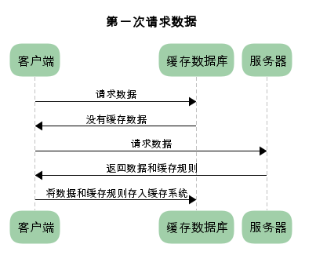

# 缓存

## 缓存分类：
按照缓存位置分类：
* memory cache
* disk cache
* Service Worker

按照缓存策略分类：
* 强制缓存
* 对比缓存（协商缓存）

## 按照缓存位置分类
在浏览器的开发工具中 Network -> Size 一列看到一个请求最终的处理方式：如果是大小（多少K，多少M等)就表示是网络请求。否则会列出 `from memory cache`,`form disk cache` 和 `from ServiceWorker`。
优先级是：（由上到下寻找，找到就返回，找不到就继续）
1. Service Worker
2. Memory Cache
3. Disk Cache
4. 网络请求

### memory cache
mermory cache 是内存中的缓存，（与之对应的 disk cache 就是硬盘上的缓存）。先读内存，再读硬盘。
几乎所有的网络请求资源都会被浏览器自动加入到 memory cache 中。数量很大，所以它只能是一个「短期存储」。
常规情况下，浏览器的 TAB 关闭后该次浏览的 memory cache 便失效了。（给其他的TAB腾出位置）。而如果极端情况下（例如一个页面的缓存就占用了超级多的内存），那可能在TAB没关闭之前，排在前面的缓存就失效了。
memory cache机制保证了一个页面如果有两个相同的请求（例如两个src 相同的 img; 或者 两个href相同的link)都实际只会被请求一次。
在从 memory cache 获取缓存内容时，浏览器会忽略 `max-age-0`,`no-cache`等头部配置。`max-age=0` 在语意上解读为：*不要在下次浏览时使用*
如果真的不要缓存，那就需要使用 `no-store`。

### disk cache
disk cache 也叫 Http cache, 存储在硬盘上，持久存储，是实际存在于文件系统的。而且它允许相同的资源在跨会话，甚至跨站点的情况下使用，例如两个站点都使用了同一张图片。

disk cache 会严格根据 HTTP 头信息中的各类字段来判定哪些资源可以缓存，哪些资源不可以缓存，哪些资源仍然可用，哪些资源是过时需要重新请求的。当命中缓存之后，浏览器会从硬盘中读资源，虽然比内存慢，但是比发起网络请求快多了。绝大部分的缓存都来自 disk cache。

### Service Worker
注册Service Worker
监听install事件，缓存需要的文件
拦截响应的缓存，否则发起fetch请求获取数据

## 缓存策略分类
我们假设浏览器存在一个缓存数据库，那么第一次发起请求的过程如下：

### 强制缓存

### 对比缓存

## Cache-Control
1. 可缓存性
   * public  http经过的任何地方就可以加上缓存
   * private  只能发起请求的浏览器才可以缓存
   * no-cache  不可以进行缓存
2. 到期
   * max-age = <seconds>  设置有效时长
   * s-maxage = <seconds>  为代理服务器设置
   * max-stale=<seconds>   表示超过了有效期也可以使用缓存的时间。客户端设置
3. 重新验证
   * must-revalidate 过期之后，必须重新发送请求验证，而不能直接使用缓存
   * proxy-revalidate 指定缓存服务器过期了，必须到原服务器再次发送请求
4. no-store 不允许使用缓存
5. no-transform 不允许中间服务器对发起的请求做改动
6. 前端使用缓存，但是服务端有变化了又能去请求服务器怎么操作
   * 使用webpack打包时，在js文件名上加上hash码

## 资源验证

| 请求头        | 解释                                     | 说明                      |
| ------------- | ---------------------------------------- | ------------------------- |
| Last-Modified | 上次修改时间                             | 配合If-Modified-Since使用 |
| Etag          | 数据签名 一般对资源内容进行hash计算 | 配合If-Match使用          |

