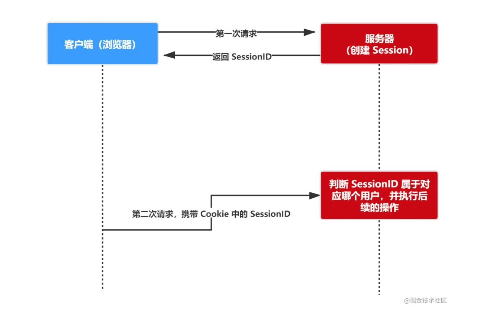

# Session
HTTP 协议是无状态的，也就是说它不知道访问当前内容的用户身份，这种情况在原始时代还行，但是随着前端的不断发展，我们需要识别到当前用户，这样我们才能对当前用户进行管理，比如是否是会员，比如这是谁的购物车，比如能否打开一些内容，等等。
这时候，Session 的方案就产生了。


## 什么是 Session？
Session 是会话状态跟踪技术。Session 将会话状态保存在了服务端。

什么是会话呢？
* 用户角度：从用户打开浏览器发送第一个请求开始，一直到最终关闭浏览器，就表示一次会话的完成。
* 程序角度：从用户打开浏览器发送第一个请求开始，一直到 session 超时，就表示一次会话的结束。


## Session 的工作原理
在服务器中，系统会为每个会话维护一个 Session，不同的会话对应不同的 Session。
那么系统是如何识别各个 Session 对象的呢？也就是系统如何做到同一个会话中使用同一个 Session 的呢？




* 创建 Session，写入 Session 列表
  * Session 列表是一个 Map
  * 服务器对当前应用中的 Session，是以 Map 的形式进行管理的，key 是 string 类型的 sessionId，value 则为 Session 对象的引用。
  * 也就是说当请求到来的时候，就会将生成的 sessionId 和新生成的 Session 对象组成键值对写入到 Session 列表中去
* 服务器生成并发送 Cookie
  * 在将 Session 写入 Session 列表以后，系统还会自动将 JSESSIONID 作为 name，将 sessionId 作为 value,以 Cookie 的形式存放到响应头中，并伴随着响应，将 Cookie 发送到客户端。如果已经有 cookie，那么就不会再次设置
* 客户端接收并发送 Cookie
  * 客户端接收到这个 Cookie 之后就将其存放到浏览器的缓存中，只要客户端浏览器不关闭，浏览器缓存中的 Cookie 就不会消失，关闭了也不一定消失
  * 当用户接着发送请求的时候就会将 Cookie，伴随着请求的头部信息，一块发送到服务器
* 从 Session 列表中查找
  * 服务端从请求中获取 Cookie，然后根据 sessionId，在 session 列表中，找到这个 Session 对象，然后对这个对象的属性，进行读写操作

SessionId 是连接 Cookie 和 Session 的一道桥梁，大部分系统也是根据此原理来验证用户登录状态。


## Session 的失效
* Session 有个有效期，超过了有效期之后，Session 就失效了。
* 默认是最后一次访问开始计时 30 分钟失效。
* 也可以通过 invalidate() 方法使 Session 失效


## 存在的问题
1. 存在 CSRF 安全问题。由于 Session 是通过 Cookie 来实现的，黑客通过链接盗用 Cookie
2. 服务器需要把 SessionId 存放在数据库中，如果是百度淘宝级别的网站，会是一个巨大的开销


## 代码中的体现
> ⚠️ 下面是伪代码


服务端代码
Session 可以用很多方式在服务端进行存储，比如 文件，redis
```java
// 开启 Session。开启之后才会进行存储
Session.start();

// 设置 Session
Session.setSession('userId', 'abcsdff', 「过期时间」, 「可以看到 Cookie 的路径」);
```
这样客户端访问之后，就会把 Cookie 写到浏览器中。


```java
// 获取 Session
Session.getCookie();
```

当我们在客户端写入数据时，客户端会自动的在请求的时候把 Cookie 值带上。


## Session 和 Cookie 的区别
1. **存储位置**：Session 存储在服务器端，Cookie 存储在客户端
2. **安全性**：Session 比 Cookie 安全
3. **存取值的类型不同**：Cookie 只支持字符串，Session 支持任意类型
4. **有效期不同**：Cookie 可以设置为长时间保存，Session 一般有效期较短，客户端关闭（默认情况下）或者 Session 超时都会失效
5. **存储大小不同**：单个 Cookie 保存的数据不能超过 4K，Session 可存储的远高于 Cookie